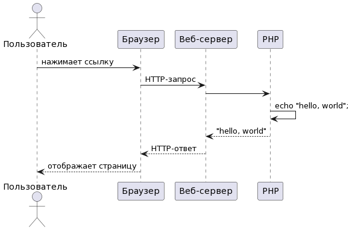

# Используем docker для веб-разработки на php

## Как php работает на вебе

Когда мы пишем веб-приложение (сайт) на php, мы не
реализуем [веб-сервер](https://ru.wikipedia.org/wiki/%D0%92%D0%B5%D0%B1-%D1%81%D0%B5%D1%80%D0%B2%D0%B5%D1%80)
. На самом деле мы пишем только кусочек веб-приложения, который потом
соединяется с одним из универсальных веб-серверов.

<!--
```
actor Пользователь

Пользователь -> Браузер: нажимает ссылку
Браузер -> "Веб-сервер": HTTP-запрос
"Веб-сервер" -> PHP
PHP -> PHP: echo "hello, world";
PHP -> "Веб-сервер": "hello, world"
"Веб-сервер" -> Браузер: HTTP-ответ
Браузер -> Пользователь: отображает страницу
```
-->



На [хостинге](https://ru.wikipedia.org/wiki/%D0%A5%D0%BE%D1%81%D1%82%D0%B8%D0%BD%D0%B3)
веб-сервер обычно уже настроен и вам нужно просто положить ваши php-файлы в
определённую папку, что бы всё заработало. При разработке веб-приложения на
своём компьютере, придётся установить и настроить какой-нибудь веб-сервер.

## Веб-серверы

[php -S](https://www.php.net/manual/ru/features.commandline.webserver.php) --
примитивный веб-сервер, который у вас уже есть, если у вас установлен php. Его
возможностей достаточно для обучения и совсем простых проектов.

[apache](https://httpd.apache.org/docs/2.4/) -- популярный веб-сервер, который
связывается с php с помощью специального модуля. Я бы рекомендовал его, если вы
работаете с готовым проектом, который рассчитан на интеграцию именно с apache.

[nginx](https://nginx.org/ru/docs/) -- один из самых популярных веб-серверов у
разработчиков на php. nginx интегрируется с php
по [fastCGI](https://ru.wikipedia.org/wiki/FastCGI). Для большинства проектов я
бы советовал именно его.

apache или nginx можно просто установить на свой компьютер и настроить как надо.
Для новичков настройка может показаться сложной, поэтому существуют
проекты-сборки типа LAMP (
xampp, openserver, denver...), которые содержат всё необходимое для разработки с
подходящими настройками. Я против таких решений. Если вы только изучаете php, то
воспользуйтесь [встроенным сервером](https://www.php.net/manual/ru/features.commandline.webserver.php)
, это позволит вам лучше понять как всё работает. А когда возможностей
встроенного сервера вам станет мало, научитесь настраивать, например, nginx.

## docker

Если вы уже научились использовать встроенный сервер php, хотите начать работать
с базами данных и другими компонентами веб-приложений, то вам пригодится docker.

> 💡 Если вы только начинаете осваивать PHP, то не спешите настраивать docker или какую-нибудь сборку типа LAMP. Разберитесь с основами, используя [встроенный сервер php](https://www.php.net/manual/ru/features.commandline.webserver.php). Это даст вам лучшее понимание как работает веб и сэкономит кучу сил и нервов на старте.

Сегодня разработчики не устанавливают на свои компьютеры apache или nginx
обычным способом. Дело в том, что один разработчик на одном компьютере может
разрабатывать много разных приложений с разными требованиями к веб-серверам и их
настройкам. Docker предоставляет возможность завести совершенно разные
окружения (веб-серверы, базы данных и прочее) для разных проектов.

Вот как это работает:

+ Ваша операционная система умеет запустить контейнер -- ещё одну виртуальную
  систему внутри себя. В таком контейнере может быть запущено любое приложение,
  например php или веб-сервер. При этом запущенное приложение будет изолированно
  от всего остального, что есть на вашем компьютере.
+ Контейнеров может быть несколько и можно настроить связь между ними. Таким
  образом каждый компонент вашего приложения запускается в отдельном контейнере
  и взаимодействует с другими компонентами по виртуальной сети.
+ docker позволяет вам описать все необходимые для работы приложения компоненты
  и запускать и останавливать их вместе.

Получается, что для организации разработки на вашем компьютере, вам надо
установить docker и в каждом проекте описать необходимое окружение в специальном
формате. После этого, для работы над проектом, надо перейти в соответствующую
папку и запустить виртуальное окружение и локальный сайт станет доступен из
браузера.

## Пример с комментариями

Предположим вы разрабатываете сайт в папке  `mySite`. Чтобы начать использовать
докер, надо описать все сервисы сайта в специальном
файле [compose.yaml](https://docs.docker.com/compose/compose-file/). Я
рекомендую положить этот файл в отдельную папку `docker`, в которой хранить всё
что связано с запуском dev-окружения: конфиги сервисов, файлы данных и прочее.

```
mySite
├── docker
│   └── compose.yaml
└── src
    └── public
        └── index.php
```

А вот как может выглядеть ваш первый compose.yaml:

```
services:
    
  php:
    image: php # используем официальный образ php https://hub.docker.com/_/php 
    ports:
      - 8080:8080 # пробрасываем порт 8080
    volumes:
      - ../src:/mySite # монтируем нашу папку src в контейнер в папку /mySite
    working_dir: /mySite/public # переключаемся в public папку в контейнере
    entrypoint: [php, -S, 0.0.0.0:8080] # запускаем встроенный сервер php на 8080 порту
```

Теперь если перейти в папку docker в консоли и выполнить `docker compose up -d`,
то docker поднимет сервис php (первый запуск может занять много времени, докеру
нужно скачать образ php). После чего, можно зайти
на [localhost:8080](http://localhost:8080) и увидеть рабочий сайт. Чтобы
остановить mySite, надо выполнить `docker compose down`.

Преимущества такого подхода заключаются в том, что вы можете использовать разные
версии php для разных проектов, иметь разные настройки php.ini для разных
проектов, устанавливать разные модули. Закоммитьте папку docker в репозиторий и
ваши коллеги смогут развернуть у себя точно такое же окружение. Это очень
удобно.

### MySQL

В официальном образе php не установлены модули для работы с базой данных. Чтобы
это исправить, надо описать свой образ на базе исходного, добавив специальные
инструкции по установке расширений.

Создайте в паке `docker` папку `php`, а в ней создайте файл `Dockerfile`:

```
FROM php

# копируем базовый production-конфиг в php.ini
RUN mv "$PHP_INI_DIR/php.ini-production" "$PHP_INI_DIR/php.ini"

# устанавливаем pdo и mysql модули
RUN docker-php-ext-install pdo pdo_mysql
```

Также создайте конфиг `mySite.ini` в папке `docker/php`. Этот конфиг перезапишет
настройки по умолчанию:

```
date.timezone = Europe/Moscow
```

Создайте папку `docker/mysql`, а в ней конфиг `MySite.cfg`:

```
[client]
default-character-set = utf8mb4

[mysql]
default-character-set = utf8mb4

[mysqld]
init-connect='SET NAMES utf8mb4'
collation_server=utf8mb4_unicode_ci
character_set_server=utf8mb4
skip-character-set-client-handshake
default_authentication_plugin= mysql_native_password
```

Теперь надо поменять `compose.yaml`:

```
services:
    
  php:
    build: php # собираем свой образ php из Dockerfile 
    ports:
      - 8080:8080
    volumes:
      - ./php/mySite.ini:/usr/local/etc/php/conf.d/mySite.ini:ro # :ro -- read only
      - ../src:/mySite
    working_dir: /mySite/public
    entrypoint: [php, -S, 0.0.0.0:8080]
    depends_on:
      - mysql # наш сайт не может работать без базы данных
      
  mysql: # раз уж мы решили работать с mysql, то нам нужен mysql-сервер
    image: mysql # используем официальный образ mysql https://hub.docker.com/_/mysql
    environment: # переменные окружения управляют настройками mysql в контейнере, читайте об этом в описании образа https://hub.docker.com/_/mysql
      MYSQL_DATABASE: mySite
      MYSQL_USER: mySite
      MYSQL_PASSWORD: passw0rd
      MYSQL_RANDOM_ROOT_PASSWORD: true
    volumes:
      - ./mysql/mySite.cfg:/etc/mysql/conf.d/mySite.cfg:ro
      - ./mysql/data:/var/lib/mysql # файлы базы данных из контейнера пробросим в локальную папку mysql/data, чтобы не терять данные при перезапуске контейнера
```

Теперь, если запустить `docker compose up -d`, то стартует php с нашими
расширениями и mysql! Из php-контейнера, mysql-контейнер доступен по
адресу `mysql` (то есть в dsn пишем не localhost, a mysql).

Если вы хотите подключаться к базе данных с локального клиента (например из IDE)
, то не забудьте пробросить порт базы данных.

```
# ...
  mysql:
    # ...
    ports:
      - 3306:3306
```

### Nginx

Встроенный сервер php отлично подходит для изучения php, но в рабочих проектах
обычно используется nginx. Вы можете добавить nginx в `compose.yaml`.

Nginx взаимодействует с php по протоколу FastCGI, поэтому понадобится
fpm-сервер. `php/Dockerfile` будет выглядеть так:

```
FROM php:fpm-alpine

RUN mv "$PHP_INI_DIR/php.ini-development" "$PHP_INI_DIR/php.ini"

RUN docker-php-ext-install pdo pdo_mysql
```

Ещё понадобится конфиг `mySite.conf`, создайте его в папке `docker/nginx`:

```
server {
  listen 80;
  server_name localhost;
  root /usr/nginx/share/html;
  
  location / {
    try_files $uri /index.php$is_args$args;
  }
  
  location ~ \.php$ {
    fastcgi_pass php:9000;
    fastcgi_param SCRIPT_FILENAME /mySite/public$fastcgi_script_name;
    include fastcgi_params;
  }
}
```

Теперь проект выглядит так:

```
├── docker
│   ├── compose.yaml
│   ├── mysql
│   │   ├── data
│   │   └── mySite.cfg
│   ├── nginx
│   │   └── mySite.conf
│   └── php
│       ├── Dockerfile
│       └── mySite.ini
└── src
    └── public
        └── index.php
```

А файл compose.yaml так:

```
services:

    php:
      build: php
      volumes:
        - ./php/mySite.ini:/usr/local/etc/php/conf.d/mySite.ini:ro
        - ../src:/mySite
      depends_on:
        - mysql

    nginx:
      image: nginx
      ports:
        - 8080:80
      volumes:
        - ./nginx/mySite.conf:/etc/nginx/conf.d/default.conf:ro
        - ../src/public:/mySite:ro
      depends_on:
        - php

    mysql:
      image: mysql
      environment:
        MYSQL_DATABASE: mySite
        MYSQL_USER: mySite
        MYSQL_PASSWORD: passw0rd
        MYSQL_RANDOM_ROOT_PASSWORD: true
      volumes:
        - ./mysql/mySite.cfg:/etc/mysql/conf.d/mySite.cfg:ro
        - ./mysql/data:/var/lib/mysql
```

Теперь, запуская `docker compose up -d`, вы получите окружение для разработки
сайта на PHP и MySQL. При необходимости вы легко можете добавлять и другие
компоненты инфраструктуры вашего сайта.

Изучите [возможности докера](https://docs.docker.com/reference/). Этот
инструмент используется очень широко, и умение пользоваться им для разработки
сделает вас более ценным сотрудником в любой компании.

> 🐞 Хотя я запускал тестовый сайт на этом окружении, когда писал заметку, но запросто мог ошибиться или опечататься. Если вы заметили ошибку, напишите мне в [ишьюс](https://github.com/EgorBanin/EgorBanin.github.io/issues).