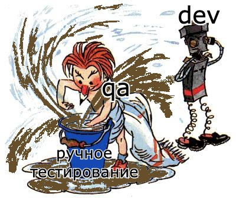
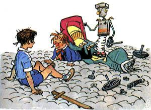
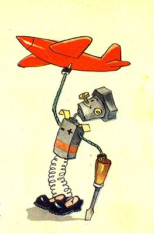
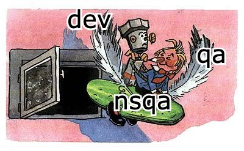
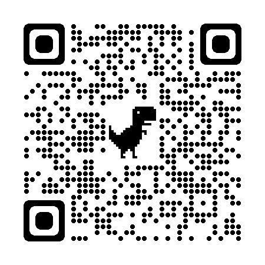

# PIY — program it yourself

Очень странно делать в ручную то, что мы можем автоматизировать!
Мы ж программисты!

## Мотивация

- чёртов ямл!
- необходимые интеграции сложно добавить
- бюрократия

- свой велосипед заточен под задачу
- развитие
- веселье

## Решения

- hjson
- wiremock
- генераторы и переменные
- только необходимые данные для фикстур

[stash.lamoda.ru/users/georgy.banin/repos/nsqa](https://stash.lamoda.ru/users/georgy.banin/repos/nsqa/browse)

