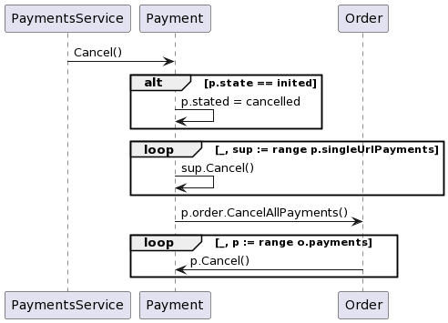

# ООП в go-проектах

Как-то так получилось, что у нас распространилось мнение о том, что ООП не подходит для  go-проектов. Что ООП это тот symfony-ад, в котором кипят php-разработчики. Хотелось пошатнуть эту позицию и привнестии больше ООП-ништяков в наш go-код.


## ООП -- это способ думать о программе

Для начала сообщу банальную, но важную вещь: ООП это не про возможности языка программирования, это про способ думать о программе как о взаимодействии объектов. В ООП-стиле можно программировать на любом языке (в языках без поддержкии ООП придётся использовать специальные соглашения, как когда-то мы использовали _ для обозначения приватных свойств класса в php).


Для нас привычно воспринимать мир как объекты. В нашем языке есть объекты существительные и их методы глаголы. Мы объединяем близкое и разделяем далёкое, мы быстро ухватываем суть и выделяем общее. Глаза, губы и нос у нас *лицо*, а на руках и на ногах *пальцы*, хотя они заметно различаются.

По какой-то нелепой случайности мы начинали изучать программирование с процедурного стиля. Хотя даже Hello world это *вывести* *сообщение* на *экран*, то есть у нас есть объект экрана, на который можно выводить объекты сообщения. Но откладывая изучение ООП мы приучаем себя к тому, что все эти объекты и методы -- это волшебные обстоятельтва. Последствия этих заблуждений остаются с нами надолго.

## ООП -- лучший способ выразить бизнес-логику

Так как ООП оперирует абстракциями принятыми в нашей культуре мышления, то объекты и методы в программе очень хорошо подходят для записи наших бизнес-мыслей. Гораздо проще развивать и поддерживать программу, в которой *заказ* можно *оплатить*, после чего *заказ* станет *оплаченным*, чем систему, в которой можно достать из бд записи у которых столбец _оплачено_ не истина, выполнить запрос во внешний сервис со значением столбца _сумма_, и по результату обновить соответствующие записи в базе данных, установив значение столбца _оплачено_ в истину.

Может показаться, что я говорю очевидные вещи. Но вот фрагмент из сервиса OM (чтобы никого не задеть, я привожу код, написанный мной):

```
функция Запросить_подтверждение(номер-заказа, данные-об-оплате):

	- получить из базы инфу-по-заказу, заказ и заказ-покупателя
	- обойти айтемы заказа и посчитать общий-статус
	- на основании общего-статуса, инфы-по-заказу и статуса-платежа из данных-об-оплате принять решение о продолжении выполнения
	- у инфы-по-заказу установить статус платежа в статус из данных-об-оплате
	- обновить в бд инфу-по-заказу
	- если инфа-по-заказу с автоподтверждением
		- стригерить в стэйт-машине событие ждём-оплату, получив новый-статус
		- отправить в шину-событий событие обнавления заказа, передав заказ-покупателя, заказ и новый-статус
	  иначе
		- отправить заказ-покупателя и заказ в контакт-центр 
```

А как могло бы быть:

```
функция Подтвердить_заказ(номер-заказа):
	- получить заказ из базы
	- подтвердить заказ
	- обновить заказ в базе данных
	- отправить в шину-событий событие обновления заказа, передав заказ
```

Кишки реализации инкапсулированы в метод *подтвердить* объекта *заказа*. Сам *заказ* единственный источник знания о заказе никакой инфы-по-заказу нет, а заказ-покупателя -- свойство заказа. Вместо ифа с автоподтверждением применяется полиморфизм.

Второе преимущество, которое мы получаем от такого ООП, -- возможность предсказать поведение кода. Разработчик может освободить свой мозг для более важных вещей. В первом фрагменте попробуйте угадать надо ли сохранять новый-статус, после триггера стэйт-машины или в коде ошибка. Во втором фрагменте, даже не читая код метода *подтвердить*, мы можем предположить, что после подтверждения заказ надо обновить в бд, и мы догадываемся, что никаких других скрытых обновлений заказа в бд тут нет.

Почему же я не написал второй вариант? У нас так не приянто.


## ООП в go

- Интерфейсы есть.
- Типы и методы -- классы и методы.
- Написание со строчной позволяет закрыть доступ за пределами пакета -- public/private.
- Нет наследования. Но, во-первых, наследование это антипаттерн и его лучше бы избегать, во-вторых, есть встраивание, которое делает композицию такой же симпатичной как наследование.

Выходит, средств языка для написания классного ООП-кода достаточно. Остаётся только научиться его писать.

### Классный ООП-код

- Объекты должны уметь что-то делать. Если объект не содержит методов и раскрывает своё состояние, то это либо плохой объект, либо хорошая DTO'шка.
- Аккуратнее с сеттерами. Хороший объект должен быть пригоден к использованию сразу после создания. Если сеттеры меняют поведение как в паттерне Билдер, то они нужны и полезны. Если сеттеры нужны чтобы доинициализировать объект, то лучше пересмотреть архитектуру кода.
- Геттеров следует избегать.
- Не надо плодить пакеты без надобности. Создать внутри пакета пакет errors, в который положить одинокий файлик с одинокой константой -- плохая идея.
- Не надо размазывать код по пакетам без необходимости. Это сложно принять, но выносить маленькую статическую функцию, которая подготавливает ответ конкретного метода апи в распухший пакет builders -- контрпродуктивно.
- Не надо размазывать методы типа по нескольким файлам. Работать со своим собственным маленьким файлом приятно, но такой стиль не позволяет оценить размер "класса". В итоге эти "классы" пухнут и плохо пахнут.
- Если часть методов работает только с одним куском состояния объекта, то это повод задуматься о разделении объекта.
- Названия типов, полей структур и методов по возможности не должны содержать повторяющиеся префиксы и суффиксы. Их либо можно безболезненно удалить, либо они намекают на необходимость выделить новый пакет.
- Названия типов и методов по возможности не должны содержать названий паттернов и других низкоуровневых абстракций, намёков на особенности реализации.
- То, что у нас написано на php, совсем не пример ООП.
- Сложные событийные архитектуры были придуманы для сложных многослойных приложений типа Фотошопа или Ворда. Апишки могут быть гораздо проще.

### Общая схема работы апишки

#### Обработчик запроса

```
1. Извлечь и провалидировать данные запроса;
2. Вызвать метод сервиса, соответствующий методу апишки;
3. Смапить ответ сервиса в ответ апишки.
```

#### Метод сервиса

```
1. Получить модель из соответствующего репозитория;
2. Вызвать метод модели, реализующий бизнес-логику;
3. Сохранить модель в репозиторий;
4. Отправить событие изменения состояния в кафку.
```

Если существует бизнеслогика, требующая реакции на событие, вызванное другой бизнес-логикой, то замените событие вызовом метода. Например, мне прилетела ошибка по single-url платежу из платёжного шлюза, надо отменить этот платёж и все остальные платежи по заказу, на отмену single-url платежа, надо отменить его и в других заказах и там тоже отменить все платежи. Тут не нужны события:

```
PaymentsService -> Payment: Cancel()
alt p.state == inited
	Payment -> Payment: p.stated = cancelled
end
loop _, sup := range p.singleUrlPayments
	Payment -> Payment: sup.Cancel()
end
Payment -> Order: p.order.CancelAllPayments()
loop _, p := range o.payments
	Order -> Payment: p.Cancel()
end
```


Прелесть такого подхода заключается в том, что разработчик может легко провалиться в код логики при необходимости и понять правила игры не загружая в мозг весь проект. А события следует оставить для взаимодействия на границе слоёв.

### Базовые паттерны ООП

- *Полиморфизм*
  - Проверка на то что платёж является платежом по сертификату у нас в коде делается в пяти разных местах. Определив разные типы для платежей можно было бы работать с платежами единообразно.
  - Прокидывая сквозь стек вызовов наши огромные DTO'шки мы проверяем некоторые поля на nil несколько раз подряд. *Особый случай* избавил бы нас от постоянных проверок.
- *Делегирование*
  - Изначально в OP консьюмеры событий EventBus просто дублировали весь бойлерплейт чтения события из очереди, хотя могли бы просто определить обрабатываемый тип события и непосредственно обработчик этого типа, реализуя *Шаблонный метод*.
- *Композиция/Агрегация*
  - Работая с пачками платежей в OP и с заказами в OM мы снова и снова пишем код обхода слайсов. Реализовав методы у слайсов платежей и заказов можно избежать дублирования кода. А реализовав что-то типа *Ленивой загрузки* можно накопить необходимые операции над элементами слайса и выполнить их за один обход.


## Заключение

Попробуйте критически рассматривать устоявшиеся в нашей разработке решения и решения, которые предлагает сообщество. Возможно наш код может быть более выразительным и эффективным, если мы откажемся от некоторых догм.