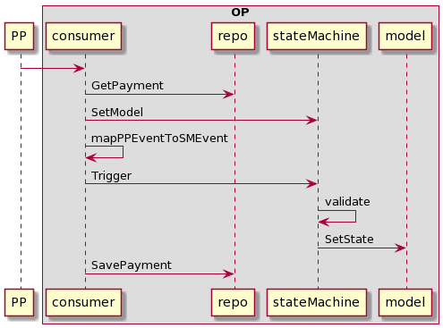
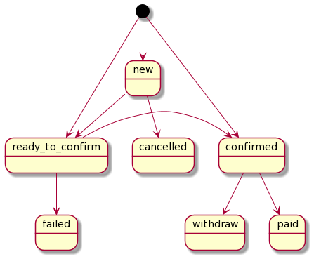
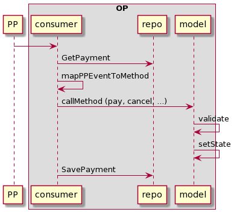
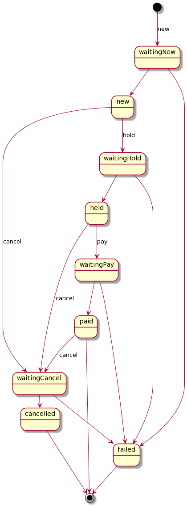

# Стэйт-машина нарушает KISS и принципы Ламоды (холивар)

```
               /\
              /  \
             /    \
            /      \
           /        \
          / паттерна \
         /  Factory   \
        /     нет      \
       /----------------\
      /   стэйт-машина   \
     / не реализует State \
    /----------------------\
   /    Outbox не boxer     \
  /--------------------------\
 /     Event bus не box       \
/______________________________\
```

Пирамида душноты :-)


## Что такое конечный автомат

Конечный автомат -- это абстракция, удобный способ представить себе работу сервиса в некоторых случаях, например при проектировании. Но реализация этой абстракции в коде ничего не даёт. Код не становится чище, а поведение не становится прозрачнее. Дополнительная абстракция путает и провоцирует на написание плохого кода.

OP курильщика:

<!--
```
participant PP
box OP
participant consumer
participant repo
participant stateMachine
participant model
end box

PP -> consumer
consumer -> repo: GetPayment
consumer -> stateMachine: SetModel
consumer -> consumer: mapPPEventToSMEvent
consumer -> stateMachine: Trigger
stateMachine -> stateMachine: validate
stateMachine -> model: SetState
consumer -> repo: SavePayment
```
-->


<!--
```
[*] --> new
[*] --> ready_to_confirm
[*] --> confirmed

new --> cancelled
new --> ready_to_confirm

ready_to_confirm --> failed
ready_to_confirm -> confirmed

confirmed --> paid

confirmed --> withdraw
```
-->

OP здорового человека:

<!--

```
participant PP
box OP
participant consumer
participant repo
participant model
end box

PP -> consumer
consumer -> repo: GetPayment
consumer -> consumer: mapPPEventToMethod
consumer -> model: callMethod (pay, cancel, ...)
model -> model: validate
model -> model: setState
consumer -> repo: SavePayment
```
-->


<!--
```
[*] --> waitingNew: new
waitingNew --> new
waitingNew --> failed

new --> waitingHold: hold
new --> waitingCancel: cancel
waitingHold --> held
waitingHold --> failed

held --> waitingPay: pay
held --> waitingCancel: cancel
waitingPay --> paid
waitingPay --> failed

paid --> waitingCancel: cancel
waitingCancel -> cancelled
waitingCancel --> failed


cancelled --> [*]
paid --> [*]
failed --> [*]
```
-->

При этом в шину мы транслируем не сам статус, а смену статуса:

```
new -> held = ready_to_confirm
new -> held + дополнительные условия = confirmed
held -> paid = paid
...
```

Обратите внимание, что в этом случае явно видно нарушение границ ответственности сервиса OP. Он управляет не только платежами, но и потоком обработки заказа.


## Шаблон State

Валидация смены статуса платежа может быть реализована, в том числе, применением шаблона State.

```
class Payment {
	- state paymentState
	+ New()
	+ Cancel()
	+ Hold()
	+ Pay()
}

interface paymentState {
	+ new()
	+ cancel()
	+ hold()
	+ pay()
}

class paymentStateNew {}
class paymentStateCancelled {}
class paymentStatePaid {}

Payment *-- paymentState
paymentState <|-- paymentStateNew
paymentState <|-- paymentStateCancelled
paymentState <|-- paymentStatePaid
```

В таком случае классы реализующие paymentState позволяют относительно легко воспринять все возможные состояния платежа. А код их методов -- простой и гибкий способ описать логику валидации. Минус такой реализации -- нельзя легко распечатать все состояния и переходы между ними. Но зато мы получаем кричащую архитектуру: платёж можно отменить или оплатить и это естественным образом изменит его состояние в какой бы части приложения мы это ни сделали.


## Стэйт-машина -- неудачное решение

Я не знаю откуда взялась стэйт-машина в Ламоде, подозреваю, что кто-то из разработчиков легаси монолита хотел объехать ограничения плохой архитектуры и запилил её. Но я не понимаю зачем мы её копируем в новые сервисы, в которых нет таких ограничений. Мы считаем её "решением", но не можем объяснить решением какой проблемы. Стэйт-машина никак не интегрируется с фрэймворком наших гошных сервисов, она не делает код проще, мы не используем возможность напечатать её в виде постера. Стэйт-машина нарушает KISS. А копируя решения из монолита, мы копируем плохую архитектуру. Считая что кто-то знает лучше какими должны быть наши сервисы, мы снимаем с себя ответственность, а это идёт вразрез с принципами Ламоды.

Давайте задавать неудобные вопросы и искать ответы на них вместе!


======================================

P.S. Для тех, кто переживал за Factory. Замена значения функцией, которая возвращает это значение, действительно шаблонный приём. Однако, этот довольно низкоуровневый паттерн часто ошибочно упоминается совместно с паттернами ООП (такими как Factory method и Abstract factory).
