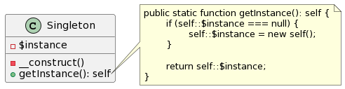
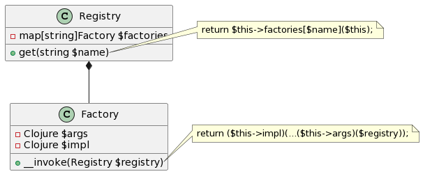

# Шаблон Singleton

Иногда приложение должно оперировать единственным экземпляром класса. Например,
приложение использующее часы, должно иметь возможность получать текущее время в
любом месте. В таком случае у разработчика может возникнуть соблазн ограничить
возможность инстанцирования объектов класса. Это ограничение встречается так
часто, что получило собственное название -- Singleton.

<!--
```
class Singleton {
	- $instance
	- __construct()
	+ getInstance(): self
}

note right of Singleton::"getInstance()"
	public static function getInstance(): self {
		if (self::$instance === null) {
			self::$instance = new self();
		}

		return self::$instance;
	}
end note
```
-->


## Singleton -- это ошибка

Глобальный метод getInstance создаёт соблазн использовать его где захочется. С
этим соблазном часто не могут справиться даже опытные разработчики. Это приводит
к созданию кода, который сложно поддерживать. Методы использующие getInstance
сложно тестировать.

Кроме того, если подумать, то изначальная проблема не требует ограничения
инстанцирования. Предоставить единственный экземпляр можно и без запрета на
создание новых экземпляров. Достаточно завести глобальную переменную и работать
с ней. Однако глобальная переменная -- это жёсткая зависимость, такая же как
getInstance. Чтобы избежать этой зависимости, переменную надо передавать в
качестве аргумента в конструкторы и методы объектов, которые используют инстанс.

## Dependency injection

Если отказаться от глобальных переменных и методов типа getInstance, то
возникнет проблема инстанцирования объектов. Например, чтобы создать экземпляр
_сервиса_, надо передать ему объект _репозитория_, а репозиторию нужен экземпляр
PDO. Чем больше аргументов-зависимостей, тем сложнее создавать объекты. На
помощь приходят функции-фабрики: можно написать функцию, которая получит все
необходимые для инстанцирования сервиса аргументы, вызывая функции-фабрики для
них, и инстанцирует сервис.

Можно написать абстракную реализацию такой функции-фабрики:

<!--
```
class Registry {
	- map[string]Factory $factories
	+ get(string $name)
}
note right of Registry::"get"
	return $this->factories[$name]($this);
end note

class Factory {
	- Clojure $args
	- Clojure $impl
	+ __invoke(Registry $registry)
}
note right of Factory::"__invoke"
	return ($this->impl)(...($this->args)($registry));
end note


Registry *-- Factory
```
-->


После этого остаётся описать все фабрики объектов и инстанцировать иерархии
через Registry::get.

## Единственный экземпляр

Чтобы фабрика возвращала единственный экземлпяр, достаточно использовать
static-переменную:

```php
function(\example\Config $config) {
	static $pdo;
	if ( ! $pdo) {
		$pdo = new \PDO('sqlite:' . $config->get('db.sqlite.fileName', ''));
	}

	return $pdo;
}
```
