# UML для проектирования и разработки на more.tv

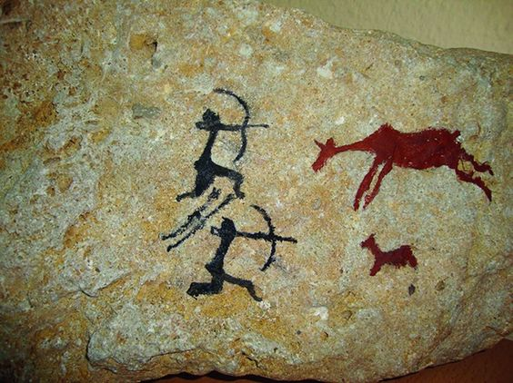

При разработке всяких программных комплексов очень важно уметь донести свою мысль другим разработчикам. Существует множество приёмов и способов сделать рабочую коммуникацию эффективной. Один из способов сделать информацию более доступной, наглядной -- это рисование схем и диаграмм.

Диаграммы могут быть очень полезны. Они помогают:
- понять и сформулировать собственные идеи,
- объяснять их другим,
- задокументировать сложную логику большого приложения.

Я заметил, что в нашей компании диаграммы используются редко и часто неправильно. Небольшой ликбез по UML (стандарту рисования диаграмм) должен помочь нам проектировать и разрабатывать лучше чем когда-либо прежде.


## Зачем вообще UML

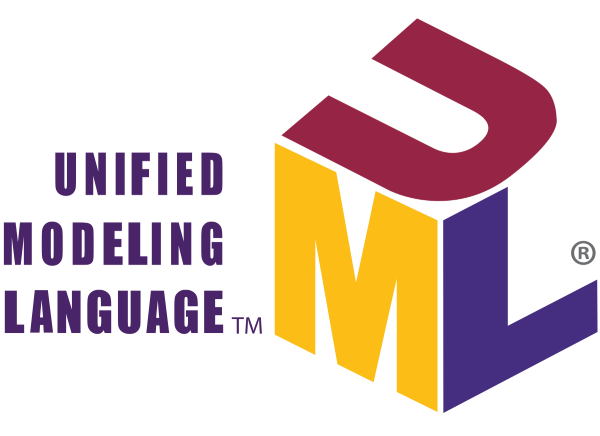

UML, как и любой стандарт, хорош тем, что ускоряет обмен информацией. Если каждый знает, что такое диаграмма последовательности, то часто достаточно показать картинку и можно обойтись без лишних слов. Теоретически можно разработать свой стандарт диаграмм, более подходящий для нашего проекта. Но овчинка выделки не стоит.

UML разрабатывался довольно упоротыми ребятами, которые среди прочего мечтали о нём как о языке декларативного графического программирования. Нарисовал стрелочки, нажал кнопку run и получил готовое приложение. Поэтому язык получился довольно сложным. Однако, для использования его в качестве стандарта для рисования на салфетках, достаточно знать только базовые правила.


## Инструменты

Для рисования диаграмм существует множество редакторов. Но на мой взгляд самым интересным вариантом для обмена идеями является [PlantUML](https://plantuml.com/ru/) нотация и [planttext.com](http://https://www.planttext.com). PlantUML это запись диаграмм простым текстом. Что-то вроде Markdown для диаграмм. Такие диаграммы легко хранить в репозиториях, редактировать, передавать в чатиках. Planttext.com рендерит PlantUML в png, svg и ASCII-графику.

Для поддержки PlantUML есть плагины для разных программ и инструментов. Мы даже используем такой в нашем конфлюенсе.

Кроме этого рисовать диаграммы можно на бумаге, на морозном стекле, помадой на зеркале и палкой на снегу.


## Использование диаграмм 

Диаграммы незаменимы при проектировании. Они позволяют воспринимать сложную логику, замечать недостатки пришедших на ум решений и модифицировать эти решения. То есть они позволяют прорабатывать идеи.

### Диаграмма классов -- разработка сущностей

Задача часто возникает как требование в процедурном стиле. Когда пользователь что-то нажимает, то у него где-то всплывает, а потом списываются деньги. При такой постановке объектное мышление заедает. Сложно с лёту придумать какие сущности взаимодействуют в данном сценарии. Каждый раз кажется, что мы имеем дело с особым случаем достойным новых объектов.

Если начать рисовать диаграмму классов, то неожиданно (на самом деле закономерно) возникают новые идеи и более глубокое понимание проблемы.

Диаграммы классов довольно просты. Однако, не стоит ошибаться с видом и направлением стрелочек.
Стрелочки реализации и наследования направлены к суперклассу или интерфейсу. Стрелочки агрегации и композиции к владельцу. Если смысл связи не имеет значения, то можно ограничится простой линией.

#### Приёмы проработки диаграммы классов

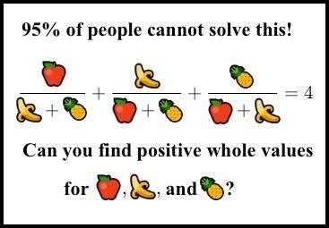

Дано:
    У Пети было 6 яблок и 2 груши, а У Миши 3 яблока и 5 груш. Петя отдал Мише 3 яблока и забрал 2 груши. Сколько яблок и груш стало у каждого из ребят.

Вот такую задачу надо решить. И в голове уже начинает вырисовываться решение. В зависимости от опыта и скила это решение может быть лучше  или хуже. Но это решение скорее всего будет хуже того решения, которое возникнет после рисования диаграмм и связанных с этим размышлений.

Думая о Мише и Пете мы можем заметить, что они по сути объекты одного класса. Назовём его `Person`.

```
class Person {
    + string name 
    - Apple[] apples
    - Pear[] pears
    + void giveApples(Apple[] apples)
    + Apple[] takeApples(int amount)
    + void givePears(Pear[] pears)
    + Pear[] takePears(int amount)
    + Apple[] getApples()
    + Pears[] getPears()
}
class Apple {}
class Pear {}

Person "1" *-- "0..*" Apple: has
Person "1" *-- "0..*" Pear: has
```

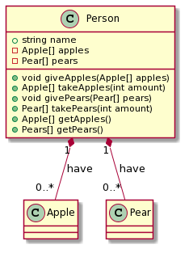

Кажется, что яблоки и груши тоже имеют кое-что общее. И то и другое фрукты -- `Fruit`.

```
class Person {
    + string name 
    - Fruit[] fruits
    + void give(Fruit[] fruits)
    + Fruit[] take(int amount, string name)
    + Fruit[] getFruits()
}
interface Fruit {
    + string getName()
}
class Apple
class Pear

Person "1" *-- "0..*" Fruit: has
Fruit <|.. Apple
Fruit <|.. Pear
```

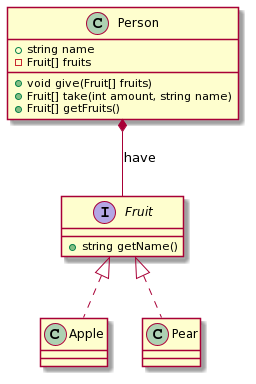

Да! Мы учились в младшей школе и гордимся тем, что знаем что яблоки и груши это фрукты. Но так ли важно что именно фруктами обмениваются ребята? Не спешите отвечать. Это зависит от деталей, которые не описаны в задаче. Будет ли эта задача возникать снова? Могут ли предметами обмена выступать овощи? А арбуз это фрукт? А будут ли ребята меняться алебастровыми шариками и дохлыми кошками как Том Сойер и Гек Финн? Требуется исследование (иногда достаточно подумать).

Если оказывается, что меняться можно всем чем угодно, то интерфейс Fruit и его реализации не нужны. Нужны какие-то штуки `Items` и они все имеют одинаковое поведение и отличаются только свойством тип.


```
class Item {
    + string type
}
```

Может оказаться и наоборот. Что обмен мы разрабатываем для ларька с фруктами. И то, что ягоды формально не являются фруктами не так уж и важно для решения нашей задачи. Тогда имя `Fruit` можно оставить для простоты восприятия.

Окей. Что с `Person`? То же самое. Надо провести исследование и выяснить важно ли, что участники обмена имеют имена и что они вообще люди и одушевлённые существа? Сейчас допустим, что это не важно.

```
class Traider {
    - Item[] items
    + give(Item[] items)
    + Item[] take(int $amount, string type)
    + Item[] getItems()
}
note left
    Тот, кто участвует в обмене.
    Например Петя или Миша.
end note

class Item {
    + string type
}

note left
    Предмет обмена.
    Яблоки, груши, всё что угодно.
end note

Traider o-- Item
```

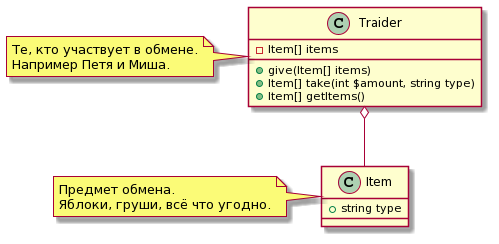


Можно пойти дальше и представить участников обмена просто как наборы `Set`. Но это означает и более абстрактные методы. Возможно другой уровень проектирования. Важно уметь найти баланс между абстрактным и конкретным, и всегда держать в голове о чём именно сейчас идёт речь.

💡 Для эффективного обмена идеями диаграмма классов должна отражать не конкретные классы в ООП программе. А те абстрактные классы, взаимодействие которых описывается. Например, в нормализованных реляционных моделях связь двух объектов может обеспечиваться через отдельную таблицу связи (многие ко многим). Рисовать класс такой таблицы, если речь идёт не о описании нормализации данных в бд, не только бесполезно, но даже вредно. Лишние классы затрудняют восприятие.

💡 Лишние подробности, детали, которые самоочевидны обозначать на диаграмме не надо. Очевидные квантификаторы, типы, детализация которых ничего не даст, косвенные связи -- всё это можно опустить. Если речь идёт о доработке существующей модели, не надо указывать все её свойства и методы, лучше сконцентрировать читателя внимание на новом функционале.


### Диаграмма последовательности -- проектирование взаимодействия

Ещё одна очень полезная диаграмма это диаграмма последовательности. Она позволяет изображать взаимодействие объектов в системе, описывать скрипты с точки зрения кто к кому зачем обращается.


```
script -> Петя: 6 яблок, 2 груши
script -> Миша: 3 яблока, 5 груш
script -> Петя: take(3, 'apple')
Петя -> script: apples
script -> Миша: give(apples)
script -> Миша: take(2, 'pear')
Миша -> script: pears
script -> Петя: give(pears)
script -> Петя: getItems()
script -> Миша: getItems()
```

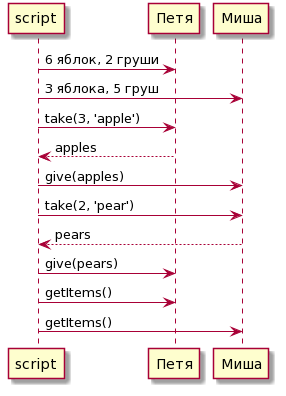

Обычно диаграмма последовательности нужна для иллюстрации более высокоуровневых взаимодействий. Но даже на этом примере заметна её польза. Тут видно, что объекты Петя и Миша не взаимодействуют друг с другом.

Попробуем что-нибудь более морское. Например диаграмма взаимодействия в сценарии переключения автопродления.

```
actor User
User -> API: POST /subscriptions/autoRenewing
API -> Nessie: GET /token/verify
API -> Atlant: GET /profile/id
API -> Billing: PATCH /v2/subscriptions/id
API -> Atlant: POST /flush
API -> Atlant: GET /profile/id
API -> User
```

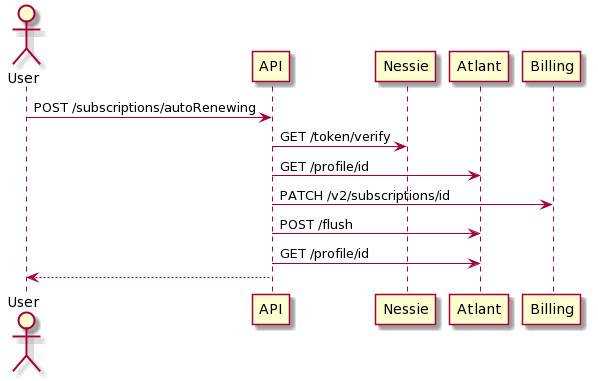

Пока такое не увидишь, не поймёшь почему API отвечает так небыстро :-) Кроме этого тут сразу видно что можно сделать лучше. Во-первых выкинуть три запроса в Атлант. Во-вторых переключать автопродление у конкретной подписки, а не у абы какой.


💡 Диаграмма взаимодействия очень простая. Но UML позволяет добавить в неё условия, циклы и прочие ништяки. Этих ништяков лучше избегать.

💡 Подробности реализации не влияющие на понимание взаимодействия (например Петю и Мишу мы инстанцируем с помощью абстрактой фабрики) тоже следует исключить.

💡 Как и в случае с диаграммой классов следует исключить очевидное. Например, обратные стрелки: если мы сделали запрос в бд, то очевидно, что бд ответит.


### Диаграмма деятельности (блок-схема)

Для описания алгоритмов можно воспользоваться диаграммой деятельности она очень похожа на блок-схему. Использование именно UML не делает алгоритм понятнее. Но PlantUML позволяет описать диаграмму текстом, а это удобно. Иногда алгоритм можно записать и просто текстом.

```
start
: Запросить N яблок;
if (N > количество яблок) then (да)
    : N = количество яблок;
endif
: уменьшить количество яблок на N;
: вернуть N;
stop
```

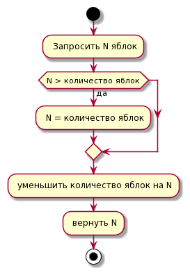

💡 При проектировании алгоритмов важно обратить внимание на то, что выход из алгоритма всегда есть и по возможности выход один.

💡 Независимые части алгоритма следует декомпозировать -- вынести в отдельные схемы. Технические детали можно пропускать.

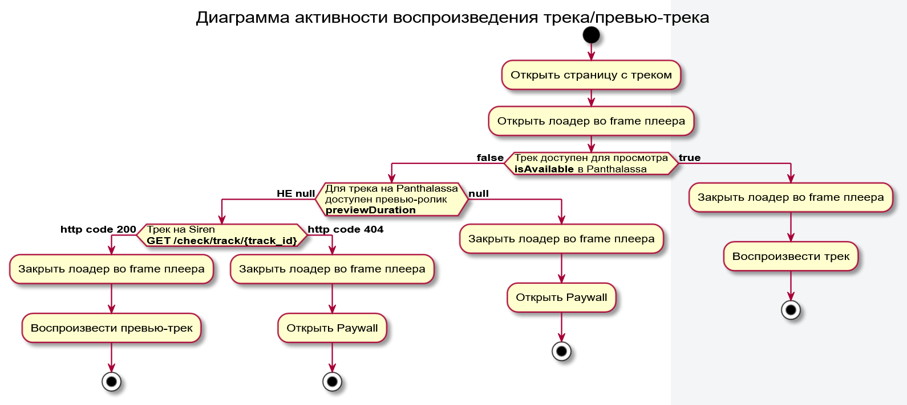

### Комментарии

Как и в программном коде, в диаграммах могут быть полезны комментарии и примеры. Они могут сопровождать диаграмму в виде обычного текста или могут быть добавлены на рисунок.

В общем случае старайтесь, чтобы ваша диаграмма была понятной и полезной тем, кто будет её читать. Разработчики знают что такое база данных, но они могут не знать что ещё за QuickFilter. Объясняйте то, что важно.

### Другие диаграммы

В UML есть и другие диаграммы. Они бывают нужны несколько реже, чем три описанные выше. Используйте то, что вам подходит. Но помните, что читатель может быть плохо знаком с некоторыми обозначениями. Коментируйте важные аспекты, не искючайте текстовое описание полностью.


## Запахи плохих диаграмм

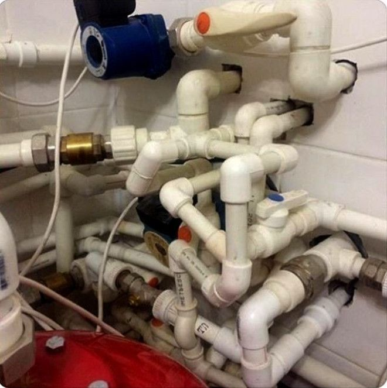

В общем случае развесистые диаграммы с большим количеством связей плохи. Это как сложное предложение с большим количеством причастных оборотов, не лишённое смысла, и возможно, обладающее даже, своего рода, изяществом, которое подчёркивает мощный интеллект и начитанность оратора, полно и точно освещающее все стороны обсуждаемого дела, сказанное в утренней беседе у кофепоинта, выслушав которое, ваш собеседник ничего не понял.

В диаграммах классов, если ваши стрелочки начинают пересекаться, образовывать кольца -- что-то не так. Либо вы имеете дело с чем-то действительно сложным (запускаете ракету на Марс?). Либо вы просто не поняли, что хотите сказать.

В диаграммах последовательностей, если диаграмма обрастает условиями и циклами -- вы сбились с пути.

В диаграммах деятельности, если ваш алгоритм ощетинился точками выхода -- вы сами не понимаете, что нарисовали.

Было

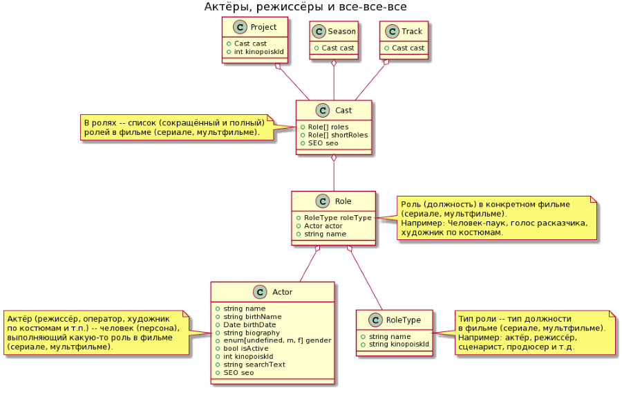

Стало

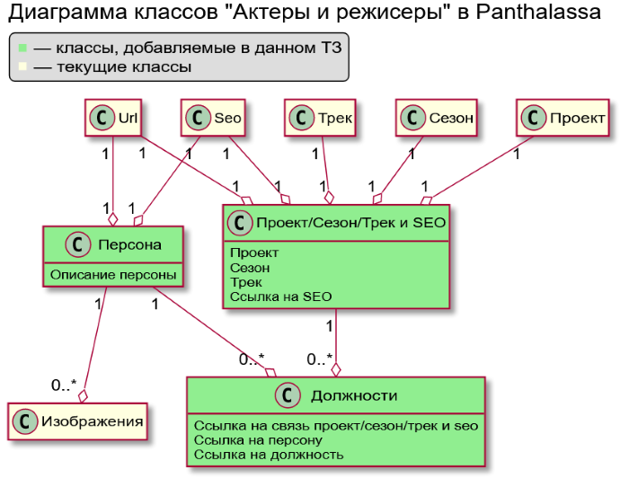


## Что почитать

Для того чтобы начать рисовать и понимать UML диаграммы, достаточно прочитать о них на википедии. Про использование UML много пишут в интернетах. Из книг могу посоветовать [UML. Основы](https://www.litres.ru/martin-fauler/uml-osnovy-3-e-izdanie-24500318/) (Фаулер 0-321-19368-7
978-5-93286-060-1).

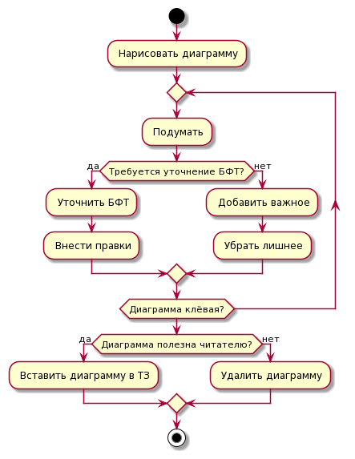