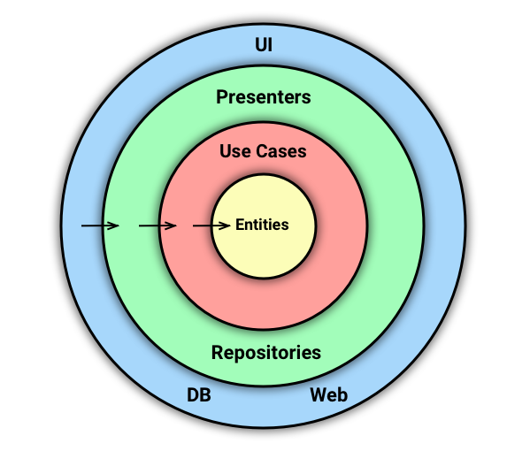
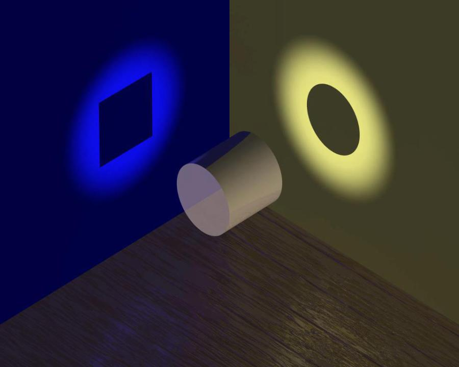

# Слои и модули на бэкенде

> В этой заметке речь пойдёт о бэкенд-проектах. Апишки гораздо проще, чем мобильные или фронтенд-приложения, поэтому их разработка должна быть простой и приятной.

Я видел несколько проектов, организованных в соответствии с идеями слоистой (гексагональной, луковичной) архитектуры. Работать с этими проектами очень неудобно. В чём причина? Идеи слоистой архитектуры плохи? Или мне просто не хватает скила справиться с чем-то вроде:

```
Builders
    - ItemBuilder
    - ещё 100500 билдеров (кстати, билдеров чего?)
Controllers
    - ItemsController
    - другие контроллеры
DTO
    - Item
    - ItemCollection
    - ItemInput
    - куча других дэтэошек
Models
    - Item
    - другие сущности тоже тут
Query
    - Item
        - ISelectQueryBuilder
        - ItemModificationQueryBuilder
        - ItemSelectQueryBuilder
    - под каждую сущность своя пачка запросов
Repositories
    - ItemRepository
    - репозитории на любой вкус
Response
    - Item
    - прочие описания ответов
Services
    - ItemService
    - службы, службы, службы
```

Но ведь на картинках это выглядело гораздо симпатичнее -- цветные кружки и стрелочки!



Конечно в примере какая-то фигня, слои называются не так, и вы бы сделали всё по-другому, не смешивая и не подменяя понятия. Вы бы сделали правильно! Но это спроектировал человек, который говорил то же самое. И проблема не в том, что эта архитектура не чистая, а в том что Item размазан по всему приложению так, что для того, чтобы отделить его, придётся объявить особый план на полгода и нанять ещё разработчиков :-)

## Как мы работаем над проектом

Работу приложения можно рассматривать в разных контекстах. С разных точек зрения приложение выполняет разные функции. Например, с одной стороны API создания заказа просто складывает джэйсончики в бд, с другой -- оперирует доменной сущностью заказа, с третьей -- является микросервисом и обеспечивает эффективную утилизацию ресурсов.



Слои удобны для рассмотрения приложения как обработчика потока данных. Бизнес-логика с этой точки зрения -- просто один из слоёв, заурядная штука, не требующая особенного внимания. Например, фрэймворки удобно проектировать и организовывать именно в таком ключе, потому что им нужно только зарезервировать место под бизнес логику.

Но если у вас уже есть фрэймворк и вы занимаетесь реализацией бизнес-логики, то удобнее будет взглянуть на проект с другой стороны. Теперь обработка данных для вас -- это только протокол, а всё самое интересное происходит в доменной области.

Если при работе над проектом в основном необходимо решать бизнес-задачи, то удобнее организовать код в виде модулей. Не бойтесь, слоистая архитектура никуда не денется, просто код будет организован по-другому.


## Модули

Модули, плагины, пакеты или бандлы -- это кусочки проекта, заключающие в себе знание о независимой области домена. Это микросервисы внутри монолита. Это маленькие луковки, слои которых обеспечивают протокол взаимодействия с фрэймворком приложения.

Все слои одного модуля находятся в одном пакете. Имена классов и методов в нём имеют гораздо больше смысла для разработчика конкретной фичи, импорт становится значительно проще и код чище. Сравните:

```php
// domain/Order.php
class Order {/* ... */}

// repositories/Order.php
class Order {/* ... */}

// presenters/Order.php
class Order {/* ... */}

// при импорте надо задать алиасы
use domain\Order;
use repositories\Order as Repo;
use presenters\Order as Presenter;
```

```php
// orders/Order.php
class Order {/* ... */}

// orders/Repo.php
class Repo {/* ... */}

// orders/Presenter.php
class Presenter {/* ... */}

// импортировать ничего не надо, всё в одном пакете
```

Такой подход делает разработку бизнес-задач проще -- не надо скакать по всему проекту, стараясь не упустить, в каком ещё слое необходимо внести правки. Не обязательно реализовывать все общие абстракции, простые модули можно упростить. Хороший модуль легко вынести в микросервис.

## Так ли важно, что говорит Дядя Боб?

Если вы построили проект по рекомендациям авторитетных специалистов и защитили его от потенциальных проблем, суть которых не очень-то понимаете, то у вас, скорее всего, плохая архитектура. Архитектура на вырост, не соответствующая сложности вашего приложения.

Не тратьте силы на поддержку переусложнённой универсальной архитектуры, постарайтесь решить реальные проблемы. Если вы снова и снова спорите о том, является ли кусочек кода сущностью или дэтэошкой, то это не важно для вашего проекта. Если добавление нового поля в джэйсон ответа занимает целый день разработки и ещё два дня баталий в пулреквесте, то к чёрту такую архитектуру!

-------------------

Идея использовать модули, конечно, не новая, эту тему можно нагуглить по запросу ["модульный монолит"](https://www.google.com/search?q=модульный+монолит).